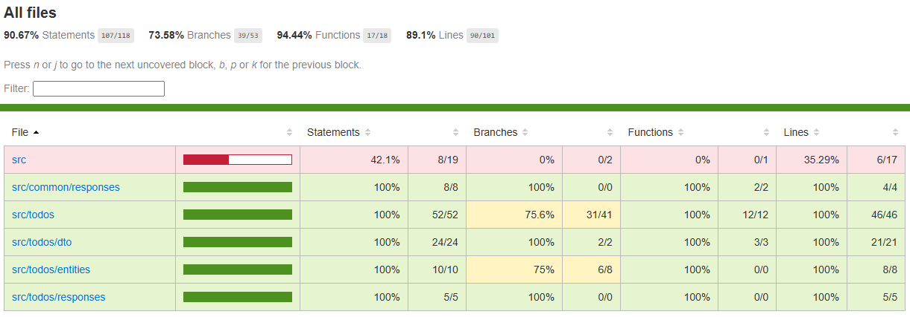

# Todo List API

Uma API REST para gerenciamento de tarefas usando NestJS, TypeORM e SQLite.

## Requisitos

- Node.js (versão 14 ou superior)
- npm ou yarn

## Instalação

1. Clone o repositório
2. Instale as dependências:

```bash
npm install
```

## Configuração

1. Copie o arquivo `.env.example` renomei-e para `.env` na raiz do projeto com o seguinte conteúdo:
```
DATABASE_TYPE=sqlite
DATABASE_NAME=todo.db
PORT=3000
```

## Executando o projeto

1. Para iniciar o servidor em modo de desenvolvimento:
```bash
npm run start:dev
```

2. O servidor estará rodando em `http://localhost:3000`
3. A documentação Swagger estará disponível em `http://localhost:3000/api`


### Media
- Cobertura de 89.1%

- Vídeo de reprodução (smoke test)
 [Vídeo Jam](https://jam.dev/c/0338e3a9-de17-495d-b00a-5994f91a05a5)


## Recursos

### 1. Todo (Tarefas)

#### 1.1. Listar todas as tarefas
- **GET** `/todos`
- **Response** (200):
```json
[
  {
    "id": 1,
    "title": "Fazer compras",

    "completed": false,
    "createdAt": "2024-03-20T10:00:00Z",
    "updatedAt": "2024-03-20T10:00:00Z"
  }
]
```

#### 1.2. Buscar tarefa por ID
- **GET** `/todos/:id`
- **Response** (200):
```json
{
  "id": 1,
  "title": "Fazer compras",
  "completed": false,
  "createdAt": "2024-03-20T10:00:00Z",
  "updatedAt": "2024-03-20T10:00:00Z"
}
```
- **Response** (404):
```json
{
  "statusCode": 404,
  "message": "Tarefa não encontrada"
}
```

#### 1.3. Criar nova tarefa
- **POST** `/todos`
- **Body**:
```json
{
  "title": "Fazer compras",
  "completed": false
}
```
- **Response** (201):
```json
{
  "id": 1,
  "title": "Fazer compras",
  "completed": false,
  "createdAt": "2024-03-20T10:00:00Z",
  "updatedAt": "2024-03-20T10:00:00Z"
}
```

#### 1.4. Atualizar tarefa
- **PUT** `/todos/:id`
- **Body**:
```json
{
  "title": "Fazer compras",
  "completed": true
}
```
- **Response** (200):
```json
{
  "id": 1,
  "title": "Fazer compras",
  "completed": true,
  "createdAt": "2024-03-20T10:00:00Z",
  "updatedAt": "2024-03-20T10:00:00Z"
}
```
- **Response** (404):
```json
{
  "statusCode": 404,
  "message": "Tarefa não encontrada"
}
```

#### 1.5. Excluir tarefa
- **DELETE** `/todos/:id`
- **Response** (204): No content
- **Response** (404):
```json
{
  "statusCode": 404,
  "message": "Tarefa não encontrada"
}
```


